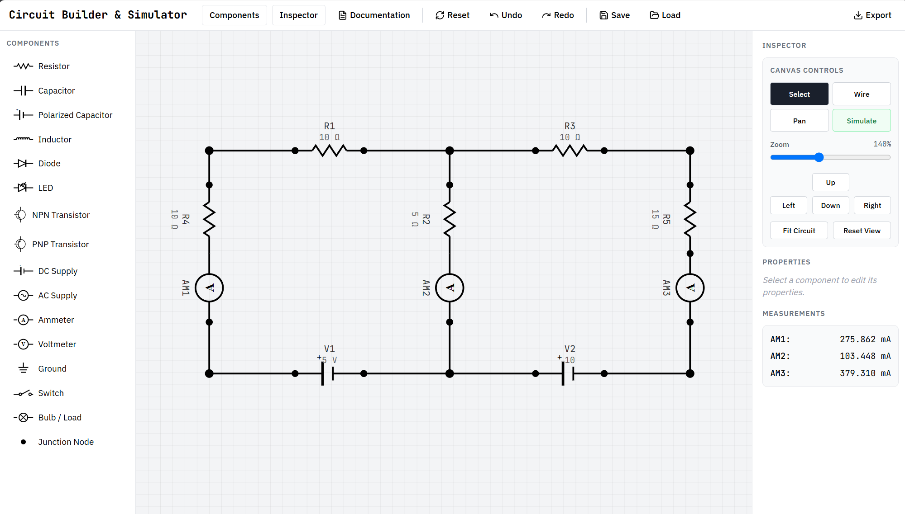

# Circuit Builder & Simulator

**Version:** 1.0.0

**Developer:** Dr. James Salveo Olarve  
**Affiliation:** i-Nano Research Facility, De La Salle University Manila

**Live App:** <https://jamesolarve.github.io/circuitdiagramsimulator/>  
**Project Page:** <https://inanolab.com/circuit.html>



## Overview

A responsive, browser-based tool for drawing electrical schematics and analyzing
basic linear DC circuits. Build a circuit on a snap-to-grid canvas, connect
component terminals, edit labels and values, inspect ideal meter readings, and
export the finished diagram for lessons, reports, worksheets, or laboratory
documentation.

## Intended Users

- Physics and electronics students learning circuits, measurement, and schematic representation
- Teachers and laboratory instructors preparing lessons, worksheets, and instructional diagrams
- STEM learners who need a lightweight, browser-based circuit drawing tool
- Researchers, laboratory staff, and hobbyists creating quick schematic sketches
- Schools and shared-computer environments where installing desktop CAD software is impractical

## Features

- 16-component schematic library
- Desktop drag-and-drop and touch-friendly tap placement
- Select, wire, and pan modes
- Editable component names, values, and rotations
- Snap-to-grid placement with connected wires that follow moved or rotated parts
- Zoom, directional pan, fit-to-view, and responsive desktop, tablet, and mobile layouts
- Up to 50 levels of undo history, with redo support
- Modified Nodal Analysis for supported steady-state DC circuits
- Ideal voltmeter and ammeter readings
- Save and load projects as JSON
- Export as SVG or PNG, and copy diagrams to the clipboard
- Keyboard navigation, visible focus states, focus-trapped dialogs, and reduced-motion support

## Component library

| Category | Components |
| --- | --- |
| Passive | Resistor, capacitor, polarized capacitor, inductor |
| Semiconductor | Diode, LED, NPN transistor, PNP transistor |
| Sources | DC supply, AC supply |
| Measurement | Ammeter, voltmeter |
| Other | Ground, switch, bulb/load, junction |

All components can be used when drawing a schematic. Simulation support is more
limited; see [DC simulation](#dc-simulation).

## Getting started

This is a single-page application with no build step or package installation.

1. Clone or download the project.
2. Serve the project directory with any static web server. For example:

   ```bash
   python -m http.server 8000
   ```

3. Open <http://localhost:8000> in a modern browser.

You can also open `index.html` directly, although a local server gives browser
features such as clipboard access a more consistent origin. An internet
connection is required to load Tailwind CSS, Lucide icons, and Google Fonts from
their CDNs.

## Basic workflow

1. Drag a component from the library to the canvas. On a touch device, tap a
   component and then tap the canvas to place it.
2. Use **Select** mode to move a component or edit its name, value, and rotation
   in the Inspector.
3. Use **Wire** mode, then select two terminal markers to connect them.
4. Add a DC supply and any meters required for a supported circuit, then select
   **Simulate**.
5. Save the editable project as JSON or export the finished schematic.

Wire segments that share endpoints belong to the same electrical node. Wires
that merely cross in the middle are **not** connected. Use a junction or redraw
the segments with a shared endpoint when a connection is intended.

## Controls

| Action | Control |
| --- | --- |
| Select, move, or edit | Select mode |
| Connect terminals | Wire mode |
| Move around the canvas | Pan mode, arrow keys, or touch gesture |
| Zoom | Mouse wheel, zoom slider, or pinch gesture |
| Rotate selected component | `R` |
| Delete selected component or wire | `Delete` or `Backspace` |
| Undo | `Ctrl+Z` |
| Redo | `Ctrl+Y` |
| Cancel placement/wiring or clear selection | `Esc` |
| Cancel an in-progress wire | Double-click the canvas |

The toolbar also provides reset, fit-to-view, save, load, export, and
documentation actions. On smaller screens these controls are reorganized into
slide-up panels and a bottom action bar.

## DC simulation

The built-in solver uses Modified Nodal Analysis for linear, steady-state DC
networks. It is designed for introductory resistor circuits and ideal
measurement setups, not as a replacement for SPICE.

| Component | DC model |
| --- | --- |
| Resistor | Resistance entered in the Value field |
| DC supply | Ideal voltage source |
| Voltmeter | Ideal open circuit |
| Ammeter | Ideal zero-resistance element |
| Capacitor / polarized capacitor | Open circuit at DC steady state |
| Inductor | Ideal short circuit at DC steady state |
| Ground / junction | Reference and connection points |

AC supplies, switches, bulbs/loads, diodes, LEDs, and transistors are available
for drawing but are not modeled. If one is present, the simulator reports an
error instead of producing an estimated result.

Additional solver behavior:

- At least one DC supply is required.
- Multiple ideal DC sources are supported unless their voltage constraints conflict.
- Ground defines 0 V. Without ground, the negative terminal of the first DC
  supply becomes the reference node.
- Voltmeter readings are signed from the meter's first terminal to its second.
- Ammeter readings are displayed as magnitudes.
- Floating nodes, open circuits, invalid values, and conflicting ideal sources
  produce descriptive errors.

### Values and SI prefixes

Enter a number followed by an optional unit, for example:

- Resistance: `10 Ω`, `4.7 kΩ`, `2.2 MΩ`
- Voltage: `5 V`, `500 mV`, `1.2e3 V`

Recognized engineering prefixes are `p`, `n`, `u`/`µ`, `m`, `k`, `M`, `G`, and
`T`.

## Saving and exporting

- **Save** downloads `circuit-project.json`, containing the components, wires,
  and reference counters.
- **Load** restores a previously saved JSON project.
- **SVG** downloads a clean, scalable schematic.
- **PNG** rasterizes the schematic at 2× resolution on a white background.
- **Copy as Image** writes a PNG to the clipboard when the browser permits it.

The current **PDF** action is a PNG fallback and does not generate a true PDF
file.

## Technology

The application is implemented in one `index.html` file using:

- Semantic HTML, responsive CSS, and vanilla JavaScript
- SVG for component symbols, wires, selection, and export
- Tailwind CSS 3.4.17 via CDN
- Lucide 0.263.0 via CDN, with inline fallback icons
- IBM Plex Sans and JetBrains Mono from Google Fonts

Project data stays in the browser until the user explicitly downloads or loads a
JSON file. No backend is required for the core editor and solver.

## Current limitations

- The solver supports only linear, steady-state DC models listed above.
- Mid-segment wire crossings do not automatically form electrical junctions.
- PDF export is not yet implemented as a true PDF.
- Component symbols are fixed to the included library unless `index.html` is
  extended.
- CDN-hosted styles, icons, and fonts are not available offline.

## Author and citation

Developed by **Dr. James Salveo Olarve** at the **i-Nano Research Facility,
De La Salle University Manila**.

Suggested citation:

> Olarve, J. S. L. (2026). *Circuit Builder & Simulator*. i-Nano Research
> Facility, De La Salle University Manila.
> <https://www.inanolab.com/circuit.html>

## Acknowledgment

Developed by the i-Nano Research Facility  
De La Salle University Manila

## License

This project is licensed under the [MIT License](LICENSE).
